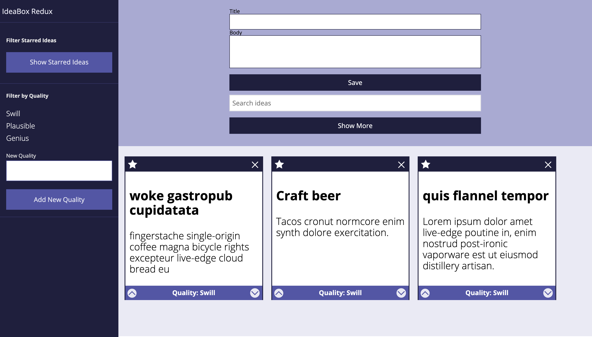
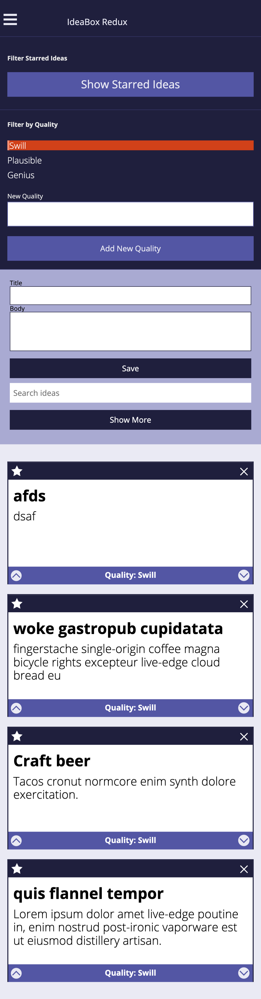

### Idea Box Redux

## Overview:
Ideabox is a web application that allows the user to add and manipulate personalized 'ideas'. These ideas are stored within
local storage, and will persist after the page is reloaded. Users can also label each card with it's own quality, and star cards that 
are important to them. The user can also take advantage of a text search functionality to find 'ideas' being displayed on the page.

## Technical Overview:
Idea box was built with HTML / CSS / and JavaScript. We leveraged classes to build and store each idea object within the page. 

## Overall Wins: 
As a team, we were able to add a lot of functionality in regards to saving, searching, and categorizing each idea. We also 
leveraged BEM principles to easily organize our HTML/CSS. 

## Overall Struggles:
I think we had some issues with the styling of the page and keeping everything responsive. We had tried experimenting with 
different approahes to the layout in order to get the over page styling where we needed. 

[link to our IdeaBox webpage](https://edwardjackc.github.io/IdeaBox/)

